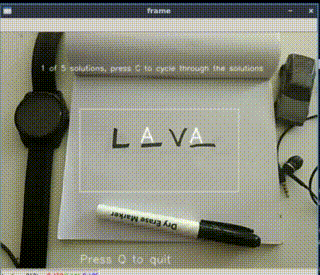

# Realtime Hangman using OpenCV
Ever played hangman in realtime using your webcam? 
If not, go ahead and try this. I have used SVM instead of Neural Networks for faster execution, you could use the latter to better the accuracy of prediction.

## Instructions

- Run pip install -r requirements.txt
- Run hangman.py
- Place the word inside the white rectangle
- Press C to cycle through the possible solutions and Q to quit
- Use only uppercase letters
- Word format should be H _ _ G _ _ N 

## Requirements
- python 3.x
- joblib
- scikit-learn
- scikit-image
- opencv-python

